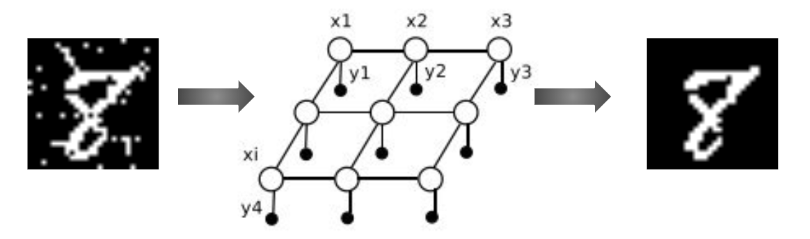

Markov Networks - Loopy Belief Propogation (LBP)
============
**Python implementation for MNIST denoising using LBP networks.**

:Authors: 
    Shahar Azulay, 039764063
    Guy Oren, 302764956
    Eitan-Hai Mashiah, 206349045

|Python27|_ |Python35|_ |License|_ 

.. |License| image:: https://img.shields.io/badge/license-BSD--3--Clause-brightgreen.svg
.. _License: https://github.com/shaharazulay/traceable-dict/blob/master/LICENSE
    
.. |Python27| image:: https://img.shields.io/badge/python-2.7-blue.svg
.. _Python27:

.. |Python35| image:: https://img.shields.io/badge/python-3.5-blue.svg
.. _Python35:
 

**Usage Examples:**

  Create a traceable dictionary 
   
        >>> python mrf_denoising.py digit.png clean_digit.png
        ...
        STARTED iteration number 22
        STARTED iteration number 23
        STARTED iteration number 24
        STARTED iteration number 25
        STARTED iteration number 26
        STOPED at iteration number 26
        
